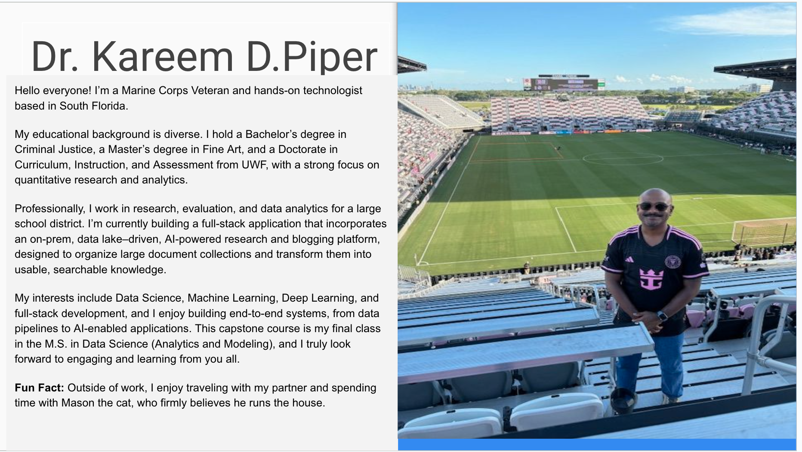
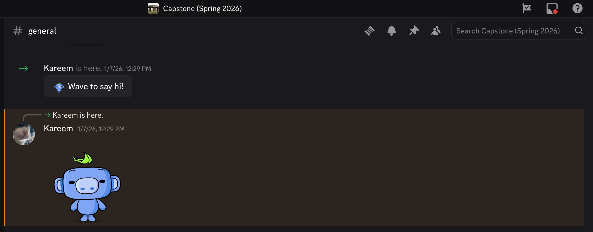
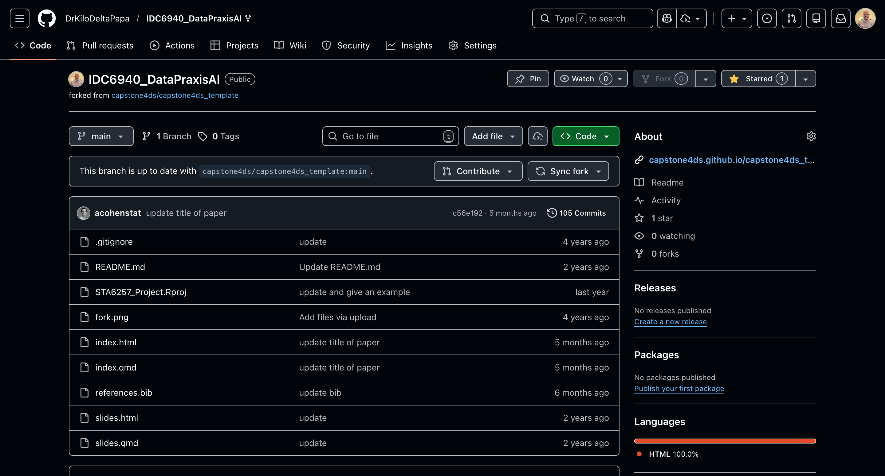

# Capstone HW #1 — Week 1

## 1) Introduce yourself and meet your classmates

Hello everyone. My name is **Dr. Kareem Piper**. I am a Marine Corps Veteran and hands-on technologist based in South Florida.

My educational background is interdisciplinary. I hold a Bachelor’s degree in Criminal Justice, a Master’s degree in Fine Art, and a Doctorate in Curriculum, Instruction, and Assessment, with a strong emphasis on quantitative research and analytics.

Professionally, I work as a **Research Specialist** for a large public school district, where I support research, evaluation, and data analytics initiatives. I am currently building a full-stack, AI-powered research and blogging platform that integrates an on-prem data lake to organize large document collections and transform them into usable, searchable knowledge.

My academic interests include **Data Science, Machine Learning, Deep Learning, and full-stack development**, and I enjoy building end-to-end systems—from data pipelines to AI-enabled applications. This capstone course is my final course in the M.S. in Data Science (Analytics and Modeling), and I look forward to learning with everyone this term.

*Fun fact:* Outside of work, I enjoy traveling with my partner and spending time with Mason, my cat, who firmly believes he runs the household.

---

## 2) Join the course Discord channel

I have joined the course Discord channel and introduced myself.

---

## 3) Tentative topic or method

**Capstone Topic:**  
**Predicting Student Attrition Using Machine Learning Models**

**Method:**  
This project will utilize machine learning and statistical modeling techniques to predict student attrition using real-world educational data. Specifically, this study will use data from the **UCI Machine Learning Repository – Predict Students’ Dropout and Academic Success** dataset, which includes demographic, socioeconomic, and academic variables.

Classification models such as **logistic regression** and **random forest** will be developed and evaluated. Model performance will be assessed using recall, F1-score, and ROC-AUC, with an emphasis on identifying early-risk students. This topic may be refined as the course progresses, with flexibility through Week 5.

---

## 4) Team members (maximum of four)

At this time, I do not have a group and would be comfortable completing the capstone independently if permitted. I currently work as a Research Specialist for a large public school district in South Florida and plan to further develop this project beyond the capstone so that it can be applied to predicting similar phenomena in an educational setting.

As such, the accompanying literature review will focus on prior studies examining **student attrition in K–12 education** and its relationship to demographic and academic factors. Because K–12 student-level data are protected under **FERPA**, this study will use publicly available **UCI higher-education data as a proxy** to model and evaluate attrition risk.

---

## 5) Reporting platform selection

I will be using **GitHub Pages (github.io)** to present my capstone progress and final research report.

